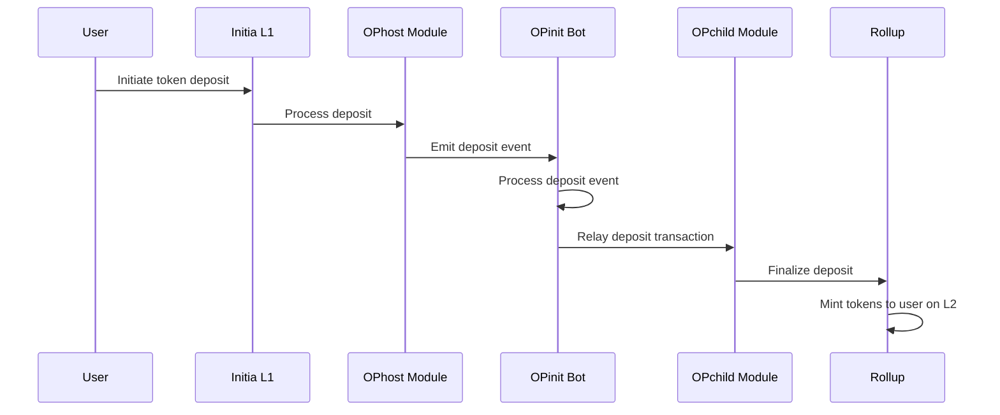
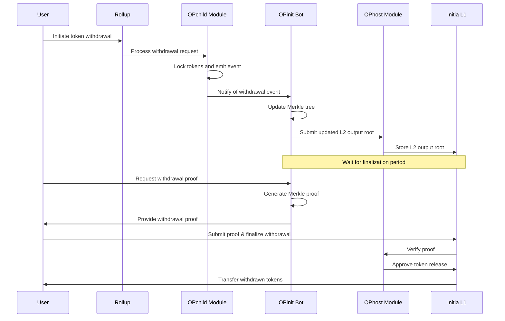
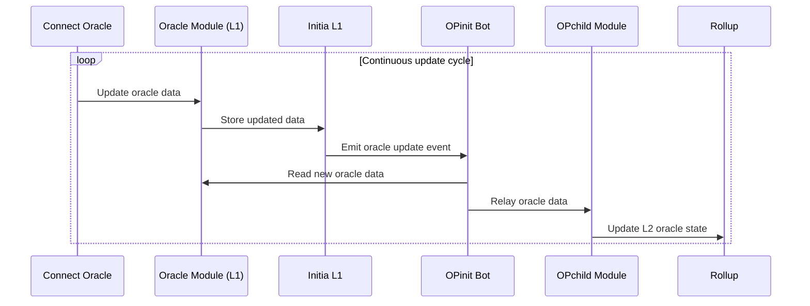
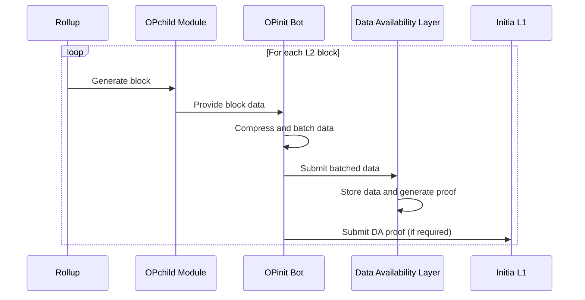

# Initia App Chain Development Context

## 1. Minitia Overview

# High Level Architecture

Initia's architecture is composed of three main components:

* **Initia L1**: The Initia L1 is the base layer and central liquidity hub for all Interwoven rollups
* **Interwoven Rollups**: An ecosystem of blockchain rollups built atop Initia L1
* **Interwoven Stack**: Initia's framework for easily and painlessly building rollups and applications

<Frame type="glass" caption="Initia Architecture">
  
</Frame>

## Components

### Initia L1

Initia L1 is a Layer 1 blockchain designed to serve as the coordination layer and central hub for all Initia rollups. This layer provides essential services to Rollups, including:

* Network Security
* Governance
* Liquidity Solutions
* Bridging and Interoperability

### Interwoven Rollups

Interwoven Rollups are an ecosystem of Layer 2 blockchains built atop Initia L1, offering a scalable, customizable, and secure infrastructure for any application. Developers have the flexibility to deploy and customize their own rollup, tailoring various aspects such as:

* Smart Contract Virtual Machine
* Gas Tokens
* Other Customizable Features

### The Interwoven Stack

The [Interwoven Stack](/home/core-concepts/interwoven-stack) is Initia's framework for building rollups and applications. It offers a seamless, integrated experience for developers.

The Stack aims to simplify the process of building and operating blockchain applications by providing native, out-of-the-box solutions for common tasks. All the tools and features that appchain developers typically need are built directly into the core Interwoven Stack, making them accessible from day one.

By reducing choice overload, Initia minimizes fragmentation and allows teams to concentrate on creating the best applications.

# Initia L1

## Overview

The Initia L1 is a custom-built Layer 1 blockchain that serves as the central coordination layer for all Interwoven Rollups. The L1 is built on the [Cosmos SDK](https://docs.cosmos.network) and is responsible for:

1. **Security**: Rollups leverage Initia L1's security for various purposes including token bridging, state commitments, and fraud proofs
2. **Liquidity**: The [InitiaDEX](/home/core-concepts/initiadex) on L1 acts as a central liquidity hub for the ecosystem, providing a seamless experience for token liquidity and cross-rollup bridging and swaps
3. **Interoperability**: L1 functions as a central hub and router for rollups, enabling seamless communication and state transitions both between rollups and with the broader blockchain ecosystem
4. **Incentives**: L1 powers various incentive schemes including the [Vested Interest Program (VIP)](/home/core-concepts/vip/introduction) and the [Enshrined Liquidity](/home/core-concepts/enshrined-liquidity/introduction)


## Interwoven Rollup Introduction

Interwoven Rollups are Layer 2 rollups built using Initia's [Interwoven Stack](/home/core-concepts/interwoven-stack/introduction). These rollups are designed to be scalable, highly interoperable, and fully customizable.

* **Virtual Machines**: Rollup teams can choose between EVM, Move, or Wasm as the virtual machine for their rollup to best suit their application and needs
* **Gas Tokens & Fees**: Each rollup can choose its own gas token and fee structure. This can include INIT, stablecoins, their native token, or even multiple tokens.
* **Transaction Ordering**: If needed, rollups can also implement their own transaction ordering mechanism.

# Rollup VMs

## MiniEVM Introduction

## Overview

The MiniEVM is a variant of Initia's rollup framework with Ethereum Virtual Machine ([EVM](https://ethereum.org/en/developers/docs/evm/)) integration. With the MiniEVM, developers can deploy and interact with Solidity and other EVM-based smart contracts just as they would on other EVM networks. All of the tools such as wallets, explorers, and developer tools that users are familiar with also work out of the box with the MiniEVM.

In addition to EVM compatibility, the MiniEVM provides a number of unique features, including:

* **Cosmos Integration**
* **Single Token Standard**
* **IBC Compatibility**

## Cosmos Integration

The MiniEVM interacts with the Cosmos blockchain through a set of custom precompiles. This integration allows the EVM to:

* **Read the Underlying Cosmos Chain State**: Access and read the state of the Cosmos blockchain directly from the EVM.
* **Send Cosmos Transactions**: Initiate and send transactions on the Cosmos blockchain.

### Notable Features

* **Query Native Connect Price Data**: Retrieve price data from the native Connect oracle.
* **Query All Tokens Held by an Account**: Obtain a comprehensive list of tokens held by a specific account.

## Single Token Standard

The MiniEVM revolves around a single token standard by implementing a custom Bank Interface that provides an ERC20 interface for all tokens on the chain. This includes:

* **Native Tokens**: Tokens that are native to the Cosmos blockchain.
* **Fee Denom Tokens**: Tokens used for transaction fees.
* **Tokens Bridged via IBC**: Tokens transferred through the Inter-Blockchain Communication (IBC) protocol.
* **ERC20 Tokens Created on the Rollup**: Standard ERC20 tokens created within the rollup framework.

### Benefits

* **Unified Balance Querying**: Ability to query all tokens held by an account in a single query.
* **Simplified Token Handling**: No need to handle different token standards in smart contracts, making development more straightforward.

***

For more detailed information, please refer to the specific sections of this documentation.


## EVM Compatibility

## Compatibility

The MiniEVM framework is compatible with all standard EVM developer workflows, tooling, and libraries that developers are already familiar. This includes popular tools like [Foundry](https://github.com/foundry-rs/foundry), [Hardhat](https://hardhat.org/), and [Remix IDE](https://remix.ethereum.org/). However, there are minor differences in the way the MiniEVM operates that may require some adjustments to your existing development workflows.

## Changes

### General

**EIP-1559 Transactions**

MiniEVM currently does not support EIP-1559 transactions. This means that when using tools like Foundry to deploy or interact with contracts, or to generally send transactions, you will need to use the legacy transaction type.

### Cosmos SDK Integrations

#### Token Representation

By default, any new Cosmos coins created on the chain, whether they are fee denomination tokens, tokens minted via IBC, or other tokens created at genesis will also have an ERC20 representation on the MiniEVM. This allows developers and users to interact with these tokens using both the Cosmos Coin interface and messages, as well as the EVM ERC20 interface.

#### Fee Tokens

While the Cosmos SDK and rollup design supports multiple fee denominations on a single network, the MiniEVM's EVM module uses a single fee token denomination for all transactions. This denomination must be one of those set on the Cosmos side.

Once set, the EVM fee denomination effectively becomes the equivalent of native tokens (e.g. ETH) on other EVM networks. This denomination will then be used for transaction fees sent via the EVM's JSON-RPC, as well as for any funds attached to EVM transactions via `msg.value`.

However, as mentioned above, unlike other EVM networks, the MiniEVM's native token is also represented by an ERC20 interface. This means that for any transaction or logic, you can also interact with it using the ERC20 interface.

## Tool Compatibility

### Foundry

**EIP 1559 Transactions**

When using Foundry to deploy or interact with contracts, or to generally send transactions, you will need to use the legacy transaction type. This can be done by using the `--legacy` flag.

**Precompiles and Foundry Scripts**

Foundry's forge script feature always simulates all script transactions on a local standard EVM (without precompiles), and there is currently [no way to skip this simulation](https://github.com/foundry-rs/foundry/issues/5776). Consequently, any contract deployment or transaction that relies on MiniEVM precompiles will fail.

## Interwoven Stack

## Overview

The **Interwoven Stack** is Initia's comprehensive, all-in-one solution designed to empower developers and teams in building and deploying rollups with unmatched ease and efficiency.

Historically, building a rollup requires developers to research, select, and piece together numerous components and services. These include:

* Choosing the right scaling solution while considering VM compatibility for each option.
* Sourcing or building wallets, explorers, bridges, and other essential tools.
* Integrating various services such as oracles, bridges, fiat on-ramps, and more.

All of these tasks divert time and resources from developers, preventing them from focusing on building their applications.

The Interwoven Stack aims to address these challenges by focusing on the following key areas:

1. **Comprehensive Product Suite:** The Stack provides developers and teams with everything needed to launch and operate a rollup, including bridges, wallets, explorers, and a multi-VM compatible [rollup framework](/home/core-concepts/interwoven-stack/opinit-framework).
2. **Seamless Interoperability:** The tools built into the Stack facilitate easy communication for the rollup, whether it's between rollups, with Initia L1, or with other blockchain ecosystems.
3. **Enhanced Security:** Robust security measures are integrated into the Stack, providing a solid foundation for building secure and trustworthy applications.

With this approach, developers can focus solely on building, improving, and shipping their applications, while the Interwoven Stack manages the heavy lifting of selecting the right tools and components for a performant and secure rollup, ensuring a smooth and optimal developer and user experience.

## OPinit Framework

## Introduction

The OPinit Framework consists of three main components: the OPinit Bridge, the Executor, and the Challenger.

## OPinit Bridge

The [OPinit Bridge](/home/core-concepts/interwoven-stack/opinit-framework/components/opinit-bridge) is a set of Cosmos SDK modules that enable the transfer of INIT and other tokens between the Initia L1 and rollup L2 using an optimistic bridge model.

## OPinit Bots

The OPinit Bots are a set of processes responsible for executing and monitoring the various actions necessary to operate and secure the rollup. Currently, there are two bots in this system: the Executor and the Challenger.

### Executor

The [Executor](/home/core-concepts/interwoven-stack/opinit-framework/components/executor) is a set of processes responsible for executing the various actions necessary to operate and secure the rollup. These include:

* **Token Transfers**: The Executor handles the OPinit Bridge token deposits and withdrawals between Initia L1 and the various rollup.
* **Output Submission**: The Executor submits the rollup's transaction outputs to the Initia L1 to finalize the rollup's state.
* **DA Batch Submission**: The Executor submits the rollup's transaction batches to the Celestia DA layer.
* **Oracle Data**: The Executor can be configured to relay the Connect oracle price data on the Initia L1 to the rollup L2 for its applications to use.

### Challenger

The [Challenger](/home/core-concepts/interwoven-stack/opinit-framework/components/challenger) is a process separate from the Executor, responsible for monitoring the Executor's output proposals and challenging any invalid proposals. This helps maintain the integrity of the rollup's state and ensures that the Executor is not acting maliciously.


## OPinit Bridge

## Overview

The OPinit Bridge is an implementation of the optimistic rollup bridge, implemented as two Cosmos SDK modules; the **OPchild Module** and the **OPhost Module**.

## OPhost Module

The OPhost Module is integrated into the Initia L1 chain. This module is responsible for:

* **Bridge Management:** Creating, updating, and managing bridges between Initia L1 and rollups.
* **Output Proposal Handling:** Managing and finalizing L2 output proposals.

## OPchild Module

The OPchild Module acts as a counter-party to the OPhost Module and is integrated into all Interwoven Rollup implementations. This module is responsible for:

* **Operator Management:** Adding, removing, and managing operators for a given rollup.
* **Bridge Message Execution:** Processing messages received from the Initia L1.
* **Oracle Updates:** Managing oracle price feed updates relayed by the OPinit Executor.

Actions related to both of these two modules are normally handled by the [OPinit Bot Executor](/home/core-concepts/interwoven-stack/opinit-framework/components/executor).


## Executor

The OPinit Bot Executor is a critical component in maintaining the communication and operational integrity between the Initia L1 and rollup blockchains. It handles and automates key tasks related to the OPinit Bridge, which facilitates cross-chain interactions and ensures that both blockchains remain synchronized and secure.

The primary responsibilities of the Executor include:

1. **Executing Token Transfers:** Executing token transfers between Initia L1 and rollup
2. **Submitting Output Proposals:** Submitting output proposals to the Initia L1
3. **Transaction Batch DA Submission:** Submitting rollup transaction batches to the DA layer
4. **Relaying Oracle Update (Optional):** Relaying oracle price feed updates to the rollup

## Detailed Architecture

### Transfer Token from L1 to L2 (Deposit)

The token deposit process begins when a user submits a deposit transaction on the Initia L1 chain. Once the transaction is confirmed, the Bridge Executor retrieves the latest block data (including the deposit) from the L1 node. It then submits a message to the rollup node to finalize the deposit. After the L2 node confirms the finalized deposit, it mints the corresponding opINIT tokens on the specified rollup.



### Transfer Token from L2 to L1 (Withdrawal)

The token withdrawal process begins when a user submits a withdrawal transaction on the rollup. Once the transaction is confirmed, the Bridge Executor retrieves the latest block data (including the withdrawal) from the L2 node. It then submits a message to the Initia L1 node to finalize the withdrawal. After the L1 node confirms the finalized withdrawal, it burns the corresponding opINIT tokens on the specified rollup.

The withdrawal then enters a withdrawal period during which the transaction can be challenged and potentially canceled. If no challenge is submitted by the end of this period, the user can claim the withdrawal on Initia L1.



The withdrawal period is designed to allow for a challenge period during which any malicious activity can be detected and addressed. If a challenge is submitted, the withdrawal is canceled. If no challenge is submitted, the transaction is finalized and the tokens are released to the user on Initia L1.

### Oracle Updates

The executor process is, when enabled on the rollup, also responsible for relaying the latest [Connect](https://github.com/skip-mev/connect) oracle data to the rollup. When relayed, the bot submits a `MsgUpdateOracle` to the L2 node.



### DA Batch Submission

Lastly, the Executor is responsible for batching and submitting transaction data to Celestia.




## Challenger

The Challenger is a process distinct from the Executor, responsible for monitoring the Executor's output proposals and challenging any invalid submissions. This ensures the integrity of rollup's state and prevents malicious actions by the Executor.

The primary responsibilities of the Challenger include:

1. **Verifying Deposits**:
   * Ensure that the `MsgInitiateTokenDeposit` event is relayed correctly to the `MsgFinalizeTokenDeposit` event.
   * Check if `MsgInitiateTokenDeposit` was relayed within the required time frame.
2. **Verifying Oracle Updates**:
   * Confirm that Oracle data is correctly relayed to `MsgUpdateOracle`.
   * Ensure that Oracle updates are processed on time.
3. **Validating Outputs**:
   * Check that the `OutputRoot` submitted with `MsgProposeOutput` is accurate.
   * Ensure that the next `MsgProposeOutput` is submitted within the expected time frame.

## Detailed Architecture

The Challenger architecture is designed to ensure that interactions between Initia (L1) and rollup (L2) are correctly validated, securing internal processes within the Initia ecosystem. Each part of the architecture is tailored to handle specific challenges while maintaining the security and reliability of the Initia-rollup interactions.

### Deposit Challenges

Deposits from L1 to L2 must follow a strict verification process to ensure that tokens are correctly transferred between chains.

The Challenger plays a critical role in this by confirming that `MsgInitiateTokenDeposit` is not only correctly triggered but also completed within a specific timeframe by matching it to `MsgFinalizeTokenDeposit`.

This prevents potential discrepancies or fraud, ensuring that deposits are secure.

When a `MsgInitiateTokenDeposit` event is detected on the L1 chain, it is recorded as a **Deposit** challenge.

The system checks if it matches the `MsgFinalizeTokenDeposit` event for the same sequence.

```go
// Deposit is the challenge event for deposit data
type Deposit struct {
	EventType     string    `json:"event_type"`
	Sequence      uint64    `json:"sequence"`
	L1BlockHeight uint64    `json:"l1_block_height"`
	From          string    `json:"from"`
	To            string    `json:"to"`
	L1Denom       string    `json:"l1_denom"`
	Amount        string    `json:"amount"`
	Time          time.Time `json:"time"`
	Timeout       bool      `json:"timeout"`
}
```

## Output Challenges

**Outputs**, which represent state changes in the L2 chain, must be correctly submitted to maintain the synchronization between L1 and L2.

The Challenger ensures that the OutputRoot of the submitted `MsgProposeOutput` matches the system’s expectations and that future proposals are made within the designated timeframe.

This process prevents any incorrect or malicious outputs from being finalized, ensuring the integrity of the system.

When a `MsgProposeOutput` event is detected on the L1 chain, it triggers an **Output** challenge.

The system replays up to the L2 block number and verifies whether the `OutputRoot` matches the one submitted.

```go
// Output is the challenge event for output data
type Output struct {
	EventType     string    `json:"event_type"`
	L2BlockNumber uint64    `json:"l2_block_number"`
	OutputIndex   uint64    `json:"output_index"`
	OutputRoot    []byte    `json:"output_root"`
	Time          time.Time `json:"time"`
	Timeout       bool      `json:"timeout"`
}
```

### Oracle Challenges

Oracles serve as external data providers for the blockchain, and any failure in updating their data can lead to inaccuracies within the system.

The Challenger ensures that oracle updates happen in a timely manner and are properly relayed from L1 to L2 through `MsgUpdateOracle`, safeguarding the accuracy of external data within the Initia ecosystem.

If the `oracle_enable` setting is turned on in bridge config, the 0th transaction's bytes are saved as an **Oracle** challenge event.

This data is verified against the `MsgUpdateOracle` for the same L1 height.

```go
// Oracle is the challenge event for oracle data
type Oracle struct {
	EventType string    `json:"event_type"`
	L1Height  uint64    `json:"l1_height"`
	Data      []byte    `json:"data"`
	Time      time.Time `json:"time"`
	Timeout   bool      `json:"timeout"`
}
```

## Rollback Challenges (TBA)

If a challenge is created and the event is not finalized within the timeout period, it is possible to rollback before the challenge is finalized. This feature will be announced in a future release.

## Deploying Rollups

> Learn how to deploy your own rollup on Initia

<Steps>
  <Step title="Install Weave">
    To get started, you need to first install our [Weave CLI](https://github.com/initia-labs/weave).

    <CodeGroup>
      ```bash macOS
      brew install initia-labs/tap/weave
      ```

      ```bash Linux (AMD64)
      VERSION=$(curl -s https://api.github.com/repos/initia-labs/weave/releases/latest | grep '"tag_name":' | cut -d'"' -f4 | cut -c 2-)
      wget https://github.com/initia-labs/weave/releases/download/v$VERSION/weave-$VERSION-linux-amd64.tar.gz
      tar -xvf weave-$VERSION-linux-amd64.tar.gz
      ```

      ```bash Linux (ARM64)
      VERSION=$(curl -s https://api.github.com/repos/initia-labs/weave/releases/latest | grep '"tag_name":' | cut -d'"' -f4 | cut -c 2-)
      wget https://github.com/initia-labs/weave/releases/download/v$VERSION/weave-$VERSION-linux-arm64.tar.gz
      tar -xvf weave-$VERSION-linux-arm64.tar.gz
      ```

      ```bash From Source
      git clone https://github.com/initia-labs/weave.git
      cd weave
      git checkout tags/v0.0.2
      VERSION=$(curl -s https://api.github.com/repos/initia-labs/weave/releases/latest | grep '"tag_name":' | cut -d'"' -f4 | cut -c 2-)
      git checkout tags/v$VERSION
      make install
      ```
    </CodeGroup>
  </Step>

  <Step title="Configure Weave and Gas Station Account">
    With Weave installed, you need to set up and fund your [gas station account](/developers/developer-guides/tools/clis/weave-cli/gas-station). This account will be used to fund the various bots and processes that is involved in the rollup's operations

    ```sh
    weave init
    ```

    This will prompt you to either generate a new account to use as your gas station account or import and existing account's mnemonic. Once you have created your account, you then need to fund it with some INIT tokens (for OPinit Bots bridging transactions) and TIA (for submitting data to Celestia).
  </Step>

  <Step title="Deploy the Rollup">
    Now that you have configured your gas station account, you can proceed to deploying your rollup.

    ```sh
    weave rollup launch
    ```

    From the provided options, you can:

    * Select your VM
    * Choose your Chain ID and (default) gas token denomination
    * Choosing DA Layer
    * Enable Price Oracle
    * Setting Genesis Accounts

    If you want more information about a specific option, access the tooltip by pressing `ctrl+T`. And if you want to go back to the previous step, press `ctrl+Z`.

    <Warning>
      To make sure that you have tokens to later send transactions on your rollup, you should add at least 1 address you control to the list of genesis accounts when prompted.
    </Warning>

    Once you have selected all the options, Weave will automatically start the rollup. When everything is complete, you will see the rollup's endpoint information, which includes the REST, RPC, and, for EVM rollups, JSON-RPC endpoints. The CLI will also create a magic link that you can use to add your rollup to InitiaScan.

    ```sh
    # Example output
    Rollup Endpoints:
    • REST API: http://localhost:1317
    • RPC: http://localhost:26657
    • RPC-WS: ws://localhost:26657/websocket
    • gRPC: http://localhost:9090

    ✨ Explore your new rollup here 🪄 (We already started the rollup app for you)
    https://scan.testnet.initia.xyz/custom-network/add/link?config=eyJ2bSI6Im1vdmUiLCJjaGFpbklkIjoiZGVtby0zMTQiLCJtaW5HYXNQcmljZSI6MCwiZGVub20iOiJ1bWluIiwibGNkIjoiaHR0cDovL2xvY2FsaG9zdDoxMzE3IiwicnBjIjoiaHR0cDovL2xvY2FsaG9zdDoyNjY1NyJ9

    i Important
    Open this in Chrome is recommended because some browsers may not support localhost access from a different host, or edit your browser's settings to allow it if necessary.
    ```

    At this point, you can now interact with your rollup, send transactions, and deploy contracts on the rollup. However, for full functionality, you will need to also run the OPinit Executor and Challenger Bots as well as the IBC Relayer.

    <Note>
      At this stage, you can interact with your rollup and deploy contracts, as well as send transactions. However, to enable bridging INIT and other tokens from L1, setting up DA, and more, you will also need to run the OPinit Executor, Challenger Bots, and the IBC Relayer. To do this, follow the steps below.
    </Note>
  </Step>

  <Step title="Start the OPinit Executor">
    The OPinit Executor bot is responsible for executing INIT bridging transactions between the Initia L1 and your rollup, submitting the rollup state output to the L1, submitting DA data to Celestia, and more. To start the bot, run

    ```sh
    weave opinit init
    ```

    This will prompt you to set up the bot's configuration through a series of questions.

    ```sh
    ✓ Existing keys in /Users/tansawit/.minitia/artifacts/config.json detected. Would you like to add these to the keyring before proceeding? > Yes, use detected keys
    ✓ Which bot would you like to run? > Executor
    ✓ Please select an option for the system key for Oracle Bridge Executor > Generate new system key
    ✓ Existing /Users/tansawit/.minitia/artifacts/config.json detected. Would you like to use the data in this file to pre-fill some fields? > Yes, prefill
    ✓ Specify listen address of the bot ... localhost:3000
    ✓ Specify L1 RPC endpoint ... https://rpc.testnet.initia.xyz:443/
    ✓ Specify rollup chain ID ... demo-314
    ✓ Specify rollup RPC endpoint ... http://localhost:26657
    ✓ Specify rollup gas denom ... umin
    ✓ OPInit bot setup successfully. Config file is saved at /Users/tansawit/.opinit/executor.json. Feel free to modify it as needed.
    ✓ You can start the bot by running `weave opinit start executor`
    ```

    Once all of that is complete, you can start the bot by running the following command.

    ```sh
    weave opinit start executor
    ```

    You should see the bot running in the terminal.

    ```sh
    Streaming logs from launchd com.opinitd.executor.daemon
    2025-02-11T17:28:42.094+0700	INFO	executor	executor/executor.go:80	bridge info	{"id": 659, "submission_interval": 60}
    2025-02-11T17:28:42.508+0700	INFO	executor	node/node.go:118	initialize height
    2025-02-11T17:28:42.525+0700	INFO	executor	node/node.go:118	initialize height
    2025-02-11T17:28:42.631+0700	INFO	executor	node/node.go:118	initialize height
    2025-02-11T17:28:43.844+0700	INFO	executor	node/node.go:118	initialize height
    2025-02-11T17:28:43.845+0700	INFO	executor	host/host.go:88	host start	{"height": 5315486}
    2025-02-11T17:28:43.845+0700	INFO	executor	child/child.go:200	child start	{"height": 1}
    2025-02-11T17:28:43.845+0700	INFO	executor	batchsubmitter/batch_submitter.go:153	batch start	{"height": 1}
    2025-02-11T17:28:43.845+0700	INFO	executor	node/node.go:173	tx checker looper stopped
    2025-02-11T17:28:43.845+0700	INFO	executor	celestia/celestia.go:98	celestia start
    2025-02-11T17:28:43.950+0700	INFO	executor	child/child.go:138	initialize tree	{"index": 1}

     ┌───────────────────────────────────────────────────┐ 
     │                   Fiber v2.52.5                   │ 
     │               http://127.0.0.1:3000               │ 
     │                                                   │ 
     │ Handlers ............. 9  Processes ........... 1 │ 
     │ Prefork ....... Disabled  PID ............. 17969 │ 
     └───────────────────────────────────────────────────┘ 

    2025-02-11T17:28:46.207+0700	INFO	executor	batchsubmitter/batch.go:173	finalize batch	{"height": 54, "batch start": 1, "batch end": 54, "batch size": 47462, "chunks": 1, "txs": 2}
    2025-02-11T17:28:52.584+0700	INFO	executor	child/withdraw.go:174	finalize working tree	{"tree_index": 1, "height": 54, "start_leaf_index": 1, "num_leaves": 0, "storage_root": "AAAAAAAAAAAAAAAAAAAAAAAAAAAAAAAAAAAAAAAAAAA="}
    ```
  </Step>

  <Step title="Start the OPinit Challenger">
    <Warning>
      For production use, we recommend setting up the Challenger bot on a separate machine from the Executor bot.
    </Warning>

    The OPinit Challenger Bot is responsible for monitoring the Executor bot's output proposal and ensuring its validity. To start the bot, run

    ```sh
    weave opinit init
    ```

    Again, you'll be guided through a series of questions similar to the Executor. The main difference is that you'll be setting up the Challenger instead of the Executor.

    ```sh
    ✓ Existing keys in /Users/tansawit/.minitia/artifacts/config.json detected. Would you like to add these to the keyring before proceeding? > Yes, use detected keys
    ✓ Which bot would you like to run? > Challenger
    ✓ Existing /Users/tansawit/.minitia/artifacts/config.json detected. Would you like to use the data in this file to pre-fill some fields? > Yes, prefill
    ✓ Specify listen address of the bot ... localhost:3001
    ✓ Specify L1 RPC endpoint ... https://rpc.testnet.initia.xyz:443/
    ✓ Specify rollup chain ID ... demo-314
    ✓ Specify rollup RPC endpoint ... http://localhost:26657
    ✓ OPInit bot setup successfully. Config file is saved at /Users/tansawit/.opinit/challenger.json. Feel free to modify it as needed.
    ✓ You can start the bot by running `weave opinit start challenger`
    ```

    Once all of that is complete, you can start the bot by running the following command.

    ```sh
    weave opinit start challenger
    ```

    You should see the bot running in the terminal.

    ```sh
    Streaming logs from launchd com.opinitd.challenger.daemon
    2025-02-11T17:31:59.060+0700	INFO	challenger	challenger/challenger.go:94	bridge info	{"id": 659, "submission_interval": 60}
    2025-02-11T17:31:59.200+0700	INFO	challenger	node/node.go:118	initialize height
    2025-02-11T17:31:59.346+0700	INFO	challenger	node/node.go:118	initialize height
    2025-02-11T17:31:59.347+0700	INFO	challenger	host/host.go:88	host start	{"height": 5315486}
    2025-02-11T17:31:59.347+0700	INFO	challenger	child/child.go:200	child start	{"height": 1}

    2025-02-11T17:31:59.347+0700	INFO	challenger	node/node.go:173	tx checker looper stopped
     ┌───────────────────────────────────────────────────┐ 
    2025-02-11T17:31:59.347+0700	INFO	challenger	node/node.go:173	tx checker looper stopped
     │                   Fiber v2.52.5                   │ 
    2025-02-11T17:31:59.452+0700	INFO	challenger	child/child.go:138	initialize tree	{"index": 1}
     │               http://127.0.0.1:3001               │ 
     │                                                   │ 
     │ Handlers ............ 11  Processes ........... 1 │ 
     │ Prefork ....... Disabled  PID ............. 20592 │ 
     └───────────────────────────────────────────────────┘ 
    ```

    If everything is working correctly, you will now have both the Executor and Challenger bots running.
  </Step>

  <Step title="Start the IBC Relayer">
    Finally, you need to set up the IBC Relayer Bot. This bot relays IBC messages between the Initia L1 and your rollup. It is essential for oracle price updates and managing IBC bridging transactions, including compatibility with Minitswap.

    ```sh
    weave relayer init
    ```

    By default, Weave also allows you to setup the relayer for any whitelisted rollup. But in this case, we will be setting up the relayer for your local rollup.

    ```sh
    ✓ Select the type of Interwoven rollup you want to relay > Local Rollup (demo-314)
    ✓ L1 network is auto-detected > initiation-2
    ✓ Specify rollup RPC endpoint ... http://localhost:26657
    ✓ Specify rollup GRPC endpoint ... http://localhost:9090
    ✓ Specify rollup WebSocket endpoint ... ws://localhost:26657/websocket
    ✓ Select method to setup IBC channels for the relayer. > Subscribe to only `transfer` and `nft-transfer` IBC Channels (minimal setup)
    ✓ Select the IBC channels you would like to relay ... 2 IBC channels subscribed
    ✓ Do you want to setup relayer with the challenger key > Yes (recommended, open the tooltip to see the details)
    ✓ Relayer setup successfully. Config file is saved at /Users/tansawit/.hermes/config.toml. Feel free to modify it as needed.
    ✓ You can start the relayer by running `weave relayer start
    ```

    Once all of that is complete, you can start the bot by running the following command.

    ```sh
    weave relayer start
    ```

    You should see the bot running in the terminal.

    ```sh
    Updating IBC client: 07-tendermint-1 of network: demo-314
    Successfully updated IBC client: 07-tendermint-1 of network: demo-314
    Updating IBC client: 07-tendermint-0 of network: demo-314
    wSuccessfully updated IBC client: 07-tendermint-0 of network: demo-314
    Streaming logs from launchd com.hermes.daemon
    2025-02-11T10:36:06.546411Z  INFO ThreadId(01) using default configuration from '/Users/tansawit/.hermes/config.toml'
    2025-02-11T10:36:06.547351Z  INFO ThreadId(01) running Hermes v1.10.4+542e14f
    2025-02-11T10:36:06.749253Z  INFO ThreadId(16) REST service running, exposing REST API at http://127.0.0.1:7010
    ```
  </Step>
</Steps>


## 2. Installation & Setup
### Weave CLI

# Installation & Setup

## Prerequisites

* Operating System: **Linux, MacOS**
* Go **v1.23** or higher
* NPM & Node **v20** or higher (if you wish to run relayer in the same machine)

## Installation

<Steps>
  <Step title="Get Weave Binary">
    <Tabs>
      <Tab title="Homebrew (macOS)">
        ```bash
        brew install initia-labs/tap/weave
        ```
      </Tab>

      <Tab title="wget (linux)">
        **AMD64**

        ```bash
        VERSION=$(curl -s https://api.github.com/repos/initia-labs/weave/releases/latest | grep '"tag_name":' | cut -d'"' -f4 | cut -c 2-)
        wget https://github.com/initia-labs/weave/releases/download/v$VERSION/weave-$VERSION-linux-amd64.tar.gz
        tar -xvf weave-$VERSION-linux-amd64.tar.gz
        ```

        **ARM64**

        ```bash
        VERSION=$(curl -s https://api.github.com/repos/initia-labs/weave/releases/latest | grep '"tag_name":' | cut -d'"' -f4 | cut -c 2-)
        wget https://github.com/initia-labs/weave/releases/download/v$VERSION/weave-$VERSION-linux-arm64.tar.gz
        tar -xvf weave-$VERSION-linux-arm64.tar.gz
        ```
      </Tab>

      <Tab title="Build from source">
        ```bash
        git clone https://github.com/initia-labs/weave.git
        cd weave
        VERSION=$(curl -s https://api.github.com/repos/initia-labs/weave/releases/latest | grep '"tag_name":' | cut -d'"' -f4 | cut -c 2-)
        git checkout tags/v$VERSION
        make install
        ```
      </Tab>
    </Tabs>
  </Step>

  <Step title="Verify Installation">
    ```bash
    weave version
    ```

    This should return the version of the Weave binary you have installed.
  </Step>

  <Step title="Quick Start">
    To get started with Weave, run

    ```bash
    weave init
    ```

    It will ask you to setup the [Gas Station](/developers/developer-guides/tools/clis/weave-cli/gas-station) account and ask which infrastructure you want to setup.
    After that, Weave will guide you through the setup process step-by-step.

    <Note>
      We recommend reading the [Gas Station](/developers/developer-guides/tools/clis/weave-cli/gas-station) section to understand the purpose and usage of the Gas Station before proceeding.
    </Note>
  </Step>
</Steps>

<Warning>
  By default, Weave collects non-identifiable usage data to help improve the product. If you prefer not to share this data, you can opt out by running the following command:

  ```bash
  weave analytics disable
  ```
</Warning>

### Next Steps

<CardGroup cols={2}>
  <Card title="Bootstrapping Initia Node" icon="microchip" href="/developers/developer-guides/tools/clis/weave-cli/initia-node">
    Setup your Initia node and start syncing with the chain.
  </Card>

  <Card title="Launching Rollup" icon="rocket-launch" href="/developers/developer-guides/tools/clis/weave-cli/rollup/launch">
    Configure and launch your own rollup.
  </Card>

  <Card title="Running IBC Relayer" icon="arrow-right-arrow-left" href="/developers/developer-guides/tools/clis/weave-cli/rollup/relayer">
    Setup and run the IBC relayer. This is necessary for built-in oracle to
    work.
  </Card>

  <Card title="Running OPinit Bots" icon="circle-nodes" href="/developers/developer-guides/tools/clis/weave-cli/rollup/opinit-bots">
    Setup the OPinit bots to complete the optimistic rollup setup.
  </Card>
</CardGroup>

or run

```bash
weave --help
```

to learn more about all the commands available.


## InterwovenKit 

> Integrate Initia Wallet into your React application with InterwovenKit

## Overview

InterwovenKit is a React library that provides seamless integration with Initia Wallet, enabling users to connect their wallets, manage accounts, and interact with the Initia blockchain directly from your React applications. It offers a complete wallet connection experience with built-in support for transactions, bridging, and account management.

## New Projects

The fastest way to get started is by cloning our example project:

```bash
git clone https://github.com/initia-labs/examples.git
cd examples/frontend/interwovenkit-react
```

<CodeGroup>
  ```bash npm
  npm install
  npm run dev
  ```

  ```bash yarn
  yarn install
  yarn dev
  ```

  ```bash pnpm
  pnpm install
  pnpm dev
  ```

  ```bash bun
  bun install
  bun dev
  ```
</CodeGroup>

The app will be available at [http://localhost:3000](http://localhost:3000/). This example demonstrates all core InterwovenKit features and serves as a reference implementation.

## Existing Projects

<CardGroup>
  <Card title="Native Integration" icon="wallet" href="/interwovenkit/integrations/native">
    Set up InterwovenKit as the default wallet connection option for your application
  </Card>

  <Card title="EVM Integration" icon="ethereum" href="/interwovenkit/integrations/evm">
    Integrate InterwovenKit with an existing EVM application
  </Card>

  <Card title="RainbowKit Integration" icon="rainbow" href="/interwovenkit/integrations/rainbowkit">
    Integrate InterwovenKit with an existing RainbowKit application
  </Card>
</CardGroup>


## Native Integration

InterwovenKit provides a native React integration for connecting and interacting with Initia wallets. This guide covers everything from basic setup to advanced features like transaction handling and cross-chain bridging.

## Prerequisites

Before integrating InterwovenKit, ensure you have:

* A React application (Next.js or Vite)
* Node.js 22+ installed
* Basic familiarity with React hooks and TypeScript

## Installation & Setup

Follow these steps to set up InterwovenKit in your application:

<Steps>
  <Step title="Install InterwovenKit">
    Install the core InterwovenKit package and its peer dependencies:

    <CodeGroup>
      ```bash npm
      npm install @initia/interwovenkit-react wagmi viem @tanstack/react-query
      ```

      ```bash yarn
      yarn add @initia/interwovenkit-react wagmi viem @tanstack/react-query
      ```

      ```bash pnpm
      pnpm add @initia/interwovenkit-react wagmi viem @tanstack/react-query
      ```

      ```bash bun
      bun add @initia/interwovenkit-react wagmi viem @tanstack/react-query
      ```
    </CodeGroup>

    These packages provide:

    * **@initia/interwovenkit-react**: React hooks and components for Initia wallet integration
    * **wagmi**: Ethereum wallet infrastructure (required for cross-chain compatibility)
    * **viem**: Low-level Ethereum interaction library
    * **@tanstack/react-query**: Data fetching and state management
  </Step>

  <Step title="Configure Providers">
    Create a providers component to set up the required React contexts. This component wraps your app with the necessary providers for wallet functionality:

    ```tsx providers.tsx
    "use client"

    import { PropsWithChildren, useEffect } from "react"
    import { createConfig, http, WagmiProvider } from "wagmi"
    import { mainnet } from "wagmi/chains"
    import { QueryClient, QueryClientProvider } from "@tanstack/react-query"
    import { initiaPrivyWalletConnector, injectStyles, InterwovenKitProvider } from "@initia/interwovenkit-react"
    import InterwovenKitStyles from "@initia/interwovenkit-react/styles.js"

    const wagmiConfig = createConfig({
      connectors: [initiaPrivyWalletConnector],
      chains: [mainnet],
      transports: { [mainnet.id]: http() },
    })
    const queryClient = new QueryClient()

    export default function Providers({ children }: PropsWithChildren) {
      useEffect(() => {
        // Inject styles into the shadow DOM used by Initia Wallet
        injectStyles(InterwovenKitStyles)
      }, [])

      return (
        <QueryClientProvider client={queryClient}>
          <WagmiProvider config={wagmiConfig}>
              <InterwovenKitProvider defaultChainId="YOUR_CHAIN_ID">{children}</InterwovenKitProvider>
          </WagmiProvider>
        </QueryClientProvider>
      )
    }
    ```

    <Info>
      **Chain Configuration**: Replace `YOUR_CHAIN_ID` with your target blockchain network:

      * `"interwoven-1"` for Initia mainnet (default)
      * `"initiation-2"` for Initia testnet
      * Or any valid chain ID from the [initia-registry](https://registry.initia.xyz)

      This sets the primary network for transactions, balance queries, and serves as the default for all operations. See the [InterwovenKitProvider reference](/interwovenkit/references/interwovenkit-provider) for details.
    </Info>
  </Step>

  <Step title="Wrap Your Application">
    Import and use the providers in your application root:

    ```tsx layout.tsx
    import Providers from "./providers"

    export default function RootLayout({
      children
    }: Readonly<{
      children: React.ReactNode
    }>) {
      return (
        <html lang="en">
          <body>
            <Providers>{children}</Providers>
          </body>
        </html>
      )
    }
    ```

    For other React frameworks, wrap your app component with the `Providers` component at the highest level possible.
  </Step>

  <Step title="Implement Wallet Connection">
    Create a basic component that demonstrates wallet connection. This component showcases the core wallet connection functionality using InterwovenKit's hooks:

    ```tsx components/WalletConnection.tsx
    "use client"

    import { truncate } from "@initia/utils"
    import { useInterwovenKit } from "@initia/interwovenkit-react"

    export default function WalletConnection() {
      const {
        address,
        username,
        isConnected,
        openConnect,
        openWallet
      } = useInterwovenKit()

      if (!isConnected) {
        return (
          <div>
            <h2>Connect Your Wallet</h2>
            <p>Connect your Initia wallet to get started</p>
            <button onClick={openConnect}>Connect Wallet</button>
          </div>
        )
      }

      return (
        <div>
          <h2>Wallet Connected</h2>
          <p>Address: {address}</p>
          {username && <p>Username: {username}</p>}
          <button onClick={openWallet}>
            {truncate(username ?? address)}
          </button>
        </div>
      )
    }
    ```
  </Step>

  <Step title="Add Transaction Functionality">
    Extend your component to handle transactions. This example demonstrates how to send a basic token transfer:

    ```tsx components/TransactionExample.tsx
    "use client"

    import { useState } from "react"
    import { MsgSend } from "cosmjs-types/cosmos/bank/v1beta1/tx"
    import { useInterwovenKit } from "@initia/interwovenkit-react"

    export default function TransactionExample() {
      const { address, requestTxBlock } = useInterwovenKit()
      const [isLoading, setIsLoading] = useState(false)
      const [lastTxHash, setLastTxHash] = useState<string>("")

      const sendTransaction = async () => {
        if (!address) return

        setIsLoading(true)
        try {
          // Create a simple send transaction to yourself
          const messages = [{
            typeUrl: "/cosmos.bank.v1beta1.MsgSend",
            value: MsgSend.fromPartial({
              fromAddress: address,
              toAddress: address,
              amount: [{ amount: "1000000", denom: "uinit" }], // 1 INIT
            }),
          }]

          const { transactionHash } = await requestTxBlock({ messages })
          setLastTxHash(transactionHash)
          console.log("Transaction successful:", transactionHash)
        } catch (error) {
          console.error("Transaction failed:", error)
        } finally {
          setIsLoading(false)
        }
      }

      if (!address) {
        return <p>Please connect your wallet first</p>
      }

      return (
        <div>
          <h3>Send Transaction</h3>
          <button
            onClick={sendTransaction}
            disabled={isLoading}
          >
            {isLoading ? "Sending..." : "Send 1 INIT to Self"}
          </button>
          {lastTxHash && (
            <p>Last transaction: {lastTxHash}</p>
          )}
        </div>
      )
    }
    ```
  </Step>

  <Step title="Custom Fee Handling (Optional)">
    The custom fee handling feature allows you to bypass the "Confirm tx" modal and provide pre-calculated fees directly, giving you more control over transaction speed and UX. The requestTx functions are still available, so you can choose the workflow that fits your app best.

    You can provide fees in two ways:

    * `Pre-calculated`: Provide a fixed fee if you are confident.
    * `Estimated`: Use estimateGas to simulate the required fee.

    <Note>
      Since this skips the standard fee selection UI, ensure the fee is displayed somewhere else in your app to maintain transparency for users.
    </Note>

    ```tsx components/TransactionExampleWithFee.tsx
     "use client"

    import { useState } from "react"
    import { MsgSend } from "cosmjs-types/cosmos/bank/v1beta1/tx"
    import { calculateFee, GasPrice } from "@cosmjs/stargate"
    import { useInterwovenKit } from "@initia/interwovenkit-react"

    export default function TransactionExample() {
      const { address, estimateGas, submitTxBlock } = useInterwovenKit()
      const [isLoading, setIsLoading] = useState(false)
      const [lastTxHash, setLastTxHash] = useState<string>("")

      const sendTransaction = async () => {
        if (!address) return

        setIsLoading(true)
        try {
          // Create a simple send transaction to yourself
          const messages = [{
            typeUrl: "/cosmos.bank.v1beta1.MsgSend",
            value: MsgSend.fromPartial({
              fromAddress: address,
              toAddress: address,
              amount: [{ amount: "1000000", denom: "uinit" }], // 1 INIT
            }),
          }]

          // Estimate gas and calculate fee
          const gas = await estimateGas({ messages })
          const fee = calculateFee(gas, GasPrice.fromString("0.015uinit"))
          const { transactionHash } = await submitTxBlock({ messages, fee })
          setLastTxHash(transactionHash)
          console.log("Transaction successful:", transactionHash)
        } catch (error) {
          console.error("Transaction failed:", error)
        } finally {
          setIsLoading(false)
        }
      }

      if (!address) {
        return <p>Please connect your wallet first</p>
      }

      return (
        <div>
          <h3>Send Transaction</h3>
          <button
            onClick={sendTransaction}
            disabled={isLoading}
          >
            {isLoading ? "Sending..." : "Send 1 INIT to Self"}
          </button>
          {lastTxHash && (
            <p>Last transaction: {lastTxHash}</p>
          )}
        </div>
      )
    }

    ```
  </Step>
</Steps>


## EVM Integration

## Overview

When working with EVM-based chains, you can configure [wagmi](https://wagmi.sh/) to connect directly to your custom EVM network instead of Ethereum mainnet. This approach allows you to:

* Use wagmi for direct interaction with your EVM chain
* Leverage Initia Wallet for interwoven rollup balance viewing and bridging
* Maintain seamless connectivity between different blockchain environments

<Info>
  **Non-EVM chains**: If your chain is not EVM-based, you can leave the default chain set to mainnet. Initia Wallet won't actually connect to Ethereum—it only uses an arbitrary signer to sign amino messages.
</Info>

## Setup Guide

<Steps>
  <Step title="Configure Providers">
    Set up your providers to connect wagmi to your custom EVM chain. This configuration includes your chain details, wagmi config, and the InterwovenKit provider.

    ```tsx  theme={null}
    // providers.tsx
    "use client"

    import { PropsWithChildren, useEffect } from "react"
    import { createConfig, http, WagmiProvider } from "wagmi"
    import { QueryClient, QueryClientProvider } from "@tanstack/react-query"
    import { initiaPrivyWalletConnector, injectStyles, InterwovenKitProvider, TESTNET } from "@initia/interwovenkit-react"
    import InterwovenKitStyles from "@initia/interwovenkit-react/styles.js"

    const minievm = {
      id: 4303131403034904,
      name: "Minievm",
      nativeCurrency: { name: "GAS", symbol: "GAS", decimals: 18 },
      rpcUrls: { default: { http: ["https://jsonrpc-evm-1.anvil.asia-southeast.initia.xyz"] } },
    }
    const wagmiConfig = createConfig({
      connectors: [initiaPrivyWalletConnector],
      chains: [minievm],
      transports: { [minievm.id]: http() },
    })
    const queryClient = new QueryClient()

    export default function Providers({ children }: PropsWithChildren) {
      useEffect(() => {
        // Inject styles into the shadow DOM used by Initia Wallet
        injectStyles(InterwovenKitStyles)
      }, [])

      return (
        <QueryClientProvider client={queryClient}>
          <WagmiProvider config={wagmiConfig}>
            <InterwovenKitProvider {...TESTNET} defaultChainId="minievm-2">
              {children}
            </InterwovenKitProvider>
          </WagmiProvider>
        </QueryClientProvider>
      )
    }
    ```

    **Key Configuration Elements:**

    * **Chain Definition**: Define your custom EVM chain with its ID, name, native currency, and RPC endpoints
    * **Wagmi Config**: Set up wagmi to use your custom chain and the Initia Privy wallet connector
    * **Style Injection**: Use `injectStyles()` to ensure proper styling within Initia Wallet's shadow DOM
    * **Provider Hierarchy**: Wrap your app with QueryClient, WagmiProvider, and InterwovenKitProvider
    * **Default Chain ID**: Set to your target rollup chain ID (e.g., `"minievm-2"` for Minievm testnet)

    <Info>
      **Chain ID Configuration**: The `defaultChainId` parameter sets the primary blockchain for Initia Wallet operations. For EVM rollups, use your rollup's chain ID (like `"minievm-2"`), not the EVM chain ID. This ensures proper balance display and bridging functionality. See [InterwovenKitProvider reference](/interwovenkit/references/interwovenkit-provider) for more details.
    </Info>
  </Step>

  <Step title="Install Dependencies">
    To follow the implementation example, install `viem` for Ethereum utilities:

    <Tabs>
      <Tab title="npm">
        ```sh npm theme={null}
        npm install viem
        ```
      </Tab>

      <Tab title="yarn">
        ```sh yarn theme={null}
        yarn add viem
        ```
      </Tab>

      <Tab title="pnpm">
        ```sh pnpm theme={null}
        pnpm add viem
        ```
      </Tab>

      <Tab title="bun">
        ```sh bun theme={null}
        bun add viem
        ```
      </Tab>
    </Tabs>
  </Step>

  <Step title="Implementation Example">
    The following React component demonstrates a complete integration that combines wagmi's EVM functionality with InterwovenKit features. This example shows how to:

    * Send transactions on your custom EVM chain using wagmi
    * Access Initia Wallet features for bridging and account management
    * Handle wallet connection states and user interactions

    ```tsx  theme={null}
    // page.tsx
    "use client"

    import { parseEther } from "viem"
    import { useAccount, useChainId, useSendTransaction, useSwitchChain } from "wagmi"
    import { truncate } from "@initia/utils"
    import { useInterwovenKit } from "@initia/interwovenkit-react"

    export default function Home() {
      const chainId = useChainId()
      const { address } = useAccount()
      const { switchChainAsync } = useSwitchChain()
      const { sendTransactionAsync } = useSendTransaction()
      const { username, openConnect, openWallet, openBridge } = useInterwovenKit()

      const send = async () => {
        await switchChainAsync({ chainId })
        const transactionHash = await sendTransactionAsync({ to: address, value: parseEther("0.01"), chainId: chainId })
        console.log("Transaction sent:", transactionHash)
      }

      const bridgeTransferDetails = {
        srcChainId: "SOURCE_CHAIN_ID",
        srcDenom: "SOURCE_ASSET_DENOM",
        dstChainId: "DESTINATION_CHAIN_ID",
        dstDenom: "DESTINATION_ASSET_DENOM",
      }

      if (!address) {
        return <button onClick={openConnect}>Connect</button>
      }

      return (
        <>
          <button onClick={send}>Send</button>
          <button onClick={() => openBridge(bridgeTransferDetails)}>Bridge</button>
          <button onClick={openWallet}>{truncate(username ?? address)}</button>
        </>
      )
    }
    ```

    **Component Features:**

    * **Transaction Handling**: The `send()` function switches to the correct chain and sends a value transfer using wagmi's `useSendTransaction`
    * **Bridge Integration**: The `bridgeTransferDetails` object defines parameters for cross-chain bridging operations
    * **Wallet Management**: Conditional rendering based on connection status, with buttons for connecting, sending transactions, bridging, and accessing the wallet interface
    * **User Experience**: Displays truncated usernames or addresses for connected users
  </Step>
</Steps>

## RainbowKit Integration

Replace InterwovenKit's default connect UI with [RainbowKit](https://rainbowkit.com) while preserving all Initia functionality. Since InterwovenKit uses wagmi connectors internally, integrating RainbowKit only changes the wallet connection interface—all other features remain identical.

<Note>
  This integration is perfect if you're already using RainbowKit in your application or prefer its UI components over the default InterwovenKit interface.
</Note>

## Overview

RainbowKit integration with InterwovenKit provides:

* **Familiar UI**: Keep using RainbowKit's polished wallet connection interface
* **Full Compatibility**: All InterwovenKit hooks and features work exactly the same
* **Easy Migration**: Drop-in replacement for the default connect UI
* **Customization**: Full access to RainbowKit's theming and customization options

## Integration Steps

<Steps>
  <Step title="Install RainbowKit">
    Add RainbowKit to your project dependencies:

    <CodeGroup>
      ```sh npm
      npm install @rainbow-me/rainbowkit
      ```

      ```sh yarn
      yarn add @rainbow-me/rainbowkit
      ```

      ```sh pnpm
      pnpm add @rainbow-me/rainbowkit
      ```

      ```sh bun
      bun add @rainbow-me/rainbowkit
      ```
    </CodeGroup>
  </Step>

  <Step title="Configure Providers">
    Update your provider configuration to include RainbowKit:

    ```tsx
    // providers.tsx
    "use client"

    import { PropsWithChildren, useEffect } from "react"
    import { createConfig, http, WagmiProvider } from "wagmi"
    import { mainnet } from "wagmi/chains"
    import { QueryClient, QueryClientProvider } from "@tanstack/react-query"
    import { connectorsForWallets, RainbowKitProvider } from "@rainbow-me/rainbowkit"
    import "@rainbow-me/rainbowkit/styles.css"
    import { initiaPrivyWallet, injectStyles, InterwovenKitProvider } from "@initia/interwovenkit-react"
    import InterwovenKitStyles from "@initia/interwovenkit-react/styles.js"

    const connectors = connectorsForWallets(
      [
        {
          groupName: "Recommended",
          wallets: [initiaPrivyWallet],
        },
      ],
      {
        appName: "Your App Name",
        projectId: "your-project-id",
      }
    )

    const wagmiConfig = createConfig({
      connectors,
      chains: [mainnet],
      transports: { [mainnet.id]: http() },
    })

    const queryClient = new QueryClient()

    export default function Providers({ children }: PropsWithChildren) {
      useEffect(() => {
        // Inject styles into the shadow DOM used by Initia Wallet
        injectStyles(InterwovenKitStyles)
      }, [])

      return (
        <QueryClientProvider client={queryClient}>
          <WagmiProvider config={wagmiConfig}>
            <RainbowKitProvider>
              <InterwovenKitProvider defaultChainId="YOUR_CHAIN_ID">
                {children}
              </InterwovenKitProvider>
            </RainbowKitProvider>
          </WagmiProvider>
        </QueryClientProvider>
      )
    }
    ```

    <Info>
      **Configuration Requirements:**

      * Replace `YOUR_CHAIN_ID` with your target blockchain network:
        * `"interwoven-1"` for Initia mainnet (default)
        * `"initiation-2"` for Initia testnet
        * Or any valid chain ID from the [initia-registry](https://registry.initia.xyz)
      * Update `appName` and `projectId` to match your application details

      The `defaultChainId` sets the primary network for all Initia Wallet operations. See [InterwovenKitProvider reference](/interwovenkit/references/interwovenkit-provider) for details.
    </Info>
  </Step>

  <Step title="Use RainbowKit Components">
    Replace InterwovenKit's connect UI with RainbowKit's `ConnectButton`:

    ```tsx
    // page.tsx
    "use client"

    import { MsgSend } from "cosmjs-types/cosmos/bank/v1beta1/tx"
    import { ConnectButton } from "@rainbow-me/rainbowkit"
    import { truncate } from "@initia/utils"
    import { useInterwovenKit } from "@initia/interwovenkit-react"

    export default function Home() {
      const { address, username, openWallet, openBridge, requestTxBlock } = useInterwovenKit()

      const send = async () => {
        const messages = [
          {
            typeUrl: "/cosmos.bank.v1beta1.MsgSend",
            value: MsgSend.fromPartial({
              fromAddress: address,
              toAddress: address,
              amount: [{ amount: "1000000", denom: "uinit" }],
            }),
          },
        ]

        const { transactionHash } = await requestTxBlock({ messages })
        console.log("Transaction sent:", transactionHash)
      }

      const bridgeTransferDetails = {
        srcChainId: "SOURCE_CHAIN_ID",
        srcDenom: "SOURCE_ASSET_DENOM",
        dstChainId: "DESTINATION_CHAIN_ID",
        dstDenom: "DESTINATION_ASSET_DENOM",
      }

      if (!address) {
        return <ConnectButton />
      }

      return (
        <>
          <button onClick={send}>Send</button>
          <button onClick={() => openBridge(bridgeTransferDetails)}>Bridge</button>
          <button onClick={openWallet}>{truncate(username ?? address)}</button>
        </>
      )
    }
    ```
  </Step>

  <Step title="Custom Fee Handling (Optional)">
    The custom fee handling feature allows you to bypass the "Confirm tx" modal and provide pre-calculated fees directly, giving you more control over transaction speed and UX. The requestTx functions are still available, so you can choose the workflow that fits your app best.

    ```tsx
    // page.tsx
    "use client"

    import { MsgSend } from "cosmjs-types/cosmos/bank/v1beta1/tx"
    import { ConnectButton } from "@rainbow-me/rainbowkit"
    import { truncate } from "@initia/utils"
    import { calculateFee, GasPrice } from "@cosmjs/stargate"
    import { useInterwovenKit } from "@initia/interwovenkit-react"

    export default function Home() {
      const { address, username, openWallet, openBridge, estimateGas, submitTxBlock } = useInterwovenKit()

      const send = async () => {
        const messages = [
          {
            typeUrl: "/cosmos.bank.v1beta1.MsgSend",
            value: MsgSend.fromPartial({
              fromAddress: address,
              toAddress: address,
              amount: [{ amount: "1000000", denom: "uinit" }],
            }),
          },
        ]

        // Estimate gas and calculate fee
        const gas = await estimateGas({ messages })
        const fee = calculateFee(gas, GasPrice.fromString("0.015uinit"))
        const { transactionHash } = await submitTxBlock({ messages, fee })
        console.log("Transaction sent:", transactionHash)
      }

      const bridgeTransferDetails = {
        srcChainId: "SOURCE_CHAIN_ID",
        srcDenom: "SOURCE_ASSET_DENOM",
        dstChainId: "DESTINATION_CHAIN_ID",
        dstDenom: "DESTINATION_ASSET_DENOM",
      }

      if (!address) {
        return <ConnectButton />
      }

      return (
        <>
          <button onClick={send}>Send</button>
          <button onClick={() => openBridge(bridgeTransferDetails)}>Bridge</button>
          <button onClick={openWallet}>{truncate(username ?? address)}</button>
        </>
      )
    }
    ```
  </Step>
</Steps>

## InterwovenKitProvider

The `InterwovenKitProvider` is the root component that enables wallet connectivity and transaction signing.

<Info>
  All applications using InterwovenKit must be wrapped with `InterwovenKitProvider` at the root level to enable wallet functionality.
</Info>

## Basic Configuration

### Chain Connection

<ParamField path="defaultChainId" type="string" default="interwoven-1">
  Sets the primary blockchain network that InterwovenKit uses as its default throughout the application. This chain is used for transactions, balance queries, appears first in asset displays, and serves as a fallback when no specific chain is provided.
</ParamField>

The `defaultChainId` parameter accepts **chain ID strings** that correspond to chains in the [Initia registry](https://registry.initia.xyz). Common values include:

**Mainnet:**

* `"interwoven-1"` - The main Initia network (default for mainnet)

**Testnet:**

* `"initiation-2"` - The Initia testnet (default for testnet)

<Info>
  When no `defaultChainId` is provided, the system automatically defaults to `"interwoven-1"` (mainnet). For testnet development, use the `TESTNET` configuration which includes `defaultChainId: "initiation-2"`.
</Info>

```tsx
// Explicitly set to mainnet
export default function Providers() {
  return (
    <InterwovenKitProvider defaultChainId="interwoven-1">
      {children}
    </InterwovenKitProvider>
  )
}

// Use testnet configuration (includes defaultChainId: "initiation-2")
export default function Providers() {
  return (
    <InterwovenKitProvider {...TESTNET}>
      {children}
    </InterwovenKitProvider>
  )
}
```

<Tip>
  The `defaultChainId` affects transaction defaults, portfolio sorting, balance queries, and bridge operations. Assets from the default chain will appear first in lists, and all operations will use this chain unless explicitly overridden.
</Tip>

### Custom Chain Support

<ParamField path="customChain" type="Chain">
  Custom chain configuration for chains not registered in the initia-registry. Use this when connecting to private or development chains.
</ParamField>

```tsx
import { Chain } from "@initia/initia-registry-types"
import { ChainSchema } from "@initia/initia-registry-types/zod"
import { InterwovenKit } from "@initia/interwovenkit-react"

const customChain: Chain = ChainSchema.parse({
  chain_id: "YOUR_CHAIN_ID",
  chain_name: "YOUR_CHAIN_NAME",
  apis: {
    rpc: [{ address: "YOUR_RPC_URL" }],
    rest: [{ address: "YOUR_LCD_URL" }],
  },
  fees: {
    fee_tokens: [{ denom: "YOUR_FEE_DENOM", fixed_min_gas_price: 0.015 }],
  },
  bech32_prefix: "init",
  network_type: "mainnet",
})

export default function Providers() {
  return (
    <InterwovenKitProvider defaultChainId="YOUR_CHAIN_ID" customChain={customChain}>
      {children}
    </InterwovenKitProvider>
  )
}
```

### UI Theme

<ParamField path="theme" type="&#x22;light&#x22; | &#x22;dark&#x22;" default="dark">
  Controls the visual theme of wallet modals and components.
</ParamField>

```tsx
export default function Providers() {
  return (
    <InterwovenKitProvider theme="light">
      {children}
    </InterwovenKitProvider>
  )
}
```

## Advanced Configuration

### Custom Message Types

For applications that use custom transaction types beyond the standard Cosmos and Initia modules, you'll need to configure protobuf types and amino converters.

<ParamField path="protoTypes" type="Iterable<[string, GeneratedType]>">
  Protobuf message types for custom transaction signing. Only required when using message types not included in default modules.
</ParamField>

```tsx
import type { GeneratedType } from "@cosmjs/proto-signing"
import { MsgCustomAction } from "./codec/myapp/tx"

const protoTypes = [
  ["/myapp.MsgCustomAction", MsgCustomAction],
] as const

export default function Providers() {
  return (
    <InterwovenKitProvider protoTypes={protoTypes}>
      {children}
    </InterwovenKitProvider>
  )
}
```

<ParamField path="aminoConverters" type="AminoConverters">
  Amino converters for encoding/decoding custom messages. Required for Amino-compatible messages not covered by default converters.
</ParamField>

```tsx
import type { AminoConverters } from "@cosmjs/stargate"

const aminoConverters: AminoConverters = {
  "/myapp.MsgCustomAction": {
    aminoType: "myapp/MsgCustomAction",
    toAmino: (msg) => ({
      creator: msg.creator,
      data: msg.data,
    }),
    fromAmino: (amino) => ({
      creator: amino.creator,
      data: amino.data,
    }),
  },
}

export default function Providers() {
  return (
    <InterwovenKitProvider aminoConverters={aminoConverters}>
      {children}
    </InterwovenKitProvider>
  )
}
```

## Testnet Configuration

### Infrastructure Endpoints

The following props are automatically configured for Initia's mainnet infrastructure and typically don't need to be set for rollup configurations:

<ParamField path="registryUrl" type="string">
  URL for the chain registry service
</ParamField>

<ParamField path="routerApiUrl" type="string">
  URL for the router API service
</ParamField>

<ParamField path="usernamesModuleAddress" type="string">
  Contract address for the usernames module
</ParamField>

### Testnet Setup

For testnet development, use the exported `TESTNET` constant which automatically configures all required endpoints:

```tsx
// providers.tsx
import { InterwovenKitProvider, TESTNET } from "@initia/interwovenkit-react"

export default function Providers() {
  return (
    <InterwovenKitProvider {...TESTNET}>
      {children}
    </InterwovenKitProvider>
  )
}
```

<Tip>
  The `TESTNET` constant automatically sets the correct `registryUrl`, `routerApiUrl`, and `usernamesModuleAddress` for Initia's testnet environment.
</Tip>

<Warning>
  When switching between testnet and mainnet environments, clear your browser's `localStorage` to avoid conflicts. InterwovenKit stores chain information locally, and cached values from different networks can cause connection errors.
</Warning>


## useInterwovenKit

The `useInterwovenKit` hook provides access to wallet connection state, account information, UI controls, and transaction utilities for interacting with the Initia blockchain.

<Info>
  This hook must be used within a component wrapped by `InterwovenKitProvider` to access wallet functionality.
</Info>

## Account Information

The hook provides multiple address formats and account details for the currently connected wallet:

<ParamField path="address" type="string">
  Current address in either Bech32 or hex format, depending on the configured `minitia` type.
</ParamField>

<ParamField path="initiaAddress" type="string">
  Bech32-formatted Initia wallet address of the connected account.
</ParamField>

<ParamField path="hexAddress" type="string">
  Hex-encoded Ethereum-compatible address of the connected account.
</ParamField>

<ParamField path="username" type="string | null">
  Optional username linked to the account. Returns `null` if no username is associated.
</ParamField>

```tsx
export default function Home() {
  const { address, initiaAddress, hexAddress, username } = useInterwovenKit()

  return (
    <>
      <div>{address}</div>
      <div>{initiaAddress}</div>
      <div>{hexAddress}</div>
      <div>{username}</div>
    </>
  )
}
```

## UI Controls

The hook provides methods for controlling wallet-related UI components:

<ParamField path="openConnect" type="() => void">
  Opens a drawer for connecting an external wallet.
</ParamField>

<ParamField path="openWallet" type="() => void">
  Opens the main wallet drawer showing balances for the connected account.
</ParamField>

<ParamField path="openBridge" type="(defaultValues?: Partial<BridgeFormValues>) => void">
  Opens the bridge drawer to onboard assets with optional pre-populated values.
</ParamField>

### Bridge Form Interface

The `BridgeFormValues` interface defines the optional parameters for pre-populating the bridge form:

<ParamField path="srcChainId" type="string">
  Source chain ID for the bridge transaction.
</ParamField>

<ParamField path="srcDenom" type="string">
  Source token denomination to bridge from.
</ParamField>

<ParamField path="dstChainId" type="string">
  Destination chain ID for the bridge transaction.
</ParamField>

<ParamField path="dstDenom" type="string">
  Destination token denomination to bridge to.
</ParamField>

<ParamField path="quantity" type="string">
  Initial bridge amount as entered by the user. Use human-readable values (e.g., "1" for 1 INIT, not "1000000").
</ParamField>

<Tip>
  All bridge form values are optional. You can pre-populate any subset of fields to improve the user experience.
</Tip>

```tsx
interface BridgeFormValues {
  srcChainId?: string
  srcDenom?: string
  dstChainId?: string
  dstDenom?: string
  quantity?: string
}
```

### Example Usage

```tsx
export default function Home() {
  const { openConnect, openWallet, openBridge } = useInterwovenKit()

  return (
    <>
      <button onClick={openConnect}>Connect</button>
      <button onClick={openWallet}>Wallet</button>
      <button onClick={() => openBridge({ srcChainId: 'chain-id', srcDenom: 'denom', dstChainId: 'chain-id', dstDenom: 'denom', quantity: '100' })}>
        Bridge
      </button>
    </>
  )
}
```

## Transaction Methods

The hook provides utilities for estimating, signing, and sending transactions on the blockchain:

<ParamField path="estimateGas" type="(txRequest: TxRequest) => Promise<number>">
  Estimates the gas required for a transaction before execution.
</ParamField>

<ParamField path="requestTxBlock" type="(txRequest: TxRequest) => Promise<DeliverTxResponse>">
  Signs, broadcasts, and waits for block inclusion, returning the complete transaction response.
</ParamField>

<ParamField path="requestTxSync" type="(txRequest: TxRequest) => Promise<string>">
  Signs and broadcasts a transaction, returning the transaction hash immediately without waiting for block inclusion.
</ParamField>

<ParamField path="submitTxBlock" type="(txParams: TxParams) => Promise<DeliverTxResponse>">
  Signs, broadcasts, and waits for block inclusion with pre-calculated fee, returning the complete transaction response.
</ParamField>

<ParamField path="submitTxSync" type="(txParams: TxParams) => Promise<string>">
  Signs and broadcasts a transaction with pre-calculated fee, returning the transaction hash immediately without waiting for block inclusion.
</ParamField>

<ParamField path="waitForTxConfirmation" type="(params: TxQuery) => Promise<IndexedTx>">
  Polls for transaction confirmation on-chain using a transaction hash.
</ParamField>

<Tip>
  Use `requestTxSync` for better UX when you want to show immediate feedback, then use `waitForTxConfirmation` to track the final transaction status. Use `requestTxBlock` when you need the complete transaction result immediately.
</Tip>

### Transaction Request Interface

The `TxRequest` interface defines the parameters for transaction operations:

<ParamField path="messages" type="EncodeObject[]" required>
  Array of encoded transaction messages to include in the transaction.
</ParamField>

<ParamField path="memo" type="string">
  Optional memo to attach to the transaction.
</ParamField>

<ParamField path="chainId" type="string">
  Target chain ID for the transaction. Defaults to the provider's `defaultChainId`.
</ParamField>

<ParamField path="gasAdjustment" type="number" default="1.4">
  Multiplier applied to the estimated gas amount for safety margin.
</ParamField>

<ParamField path="gas" type="number">
  Explicit gas limit for the transaction. If provided, skips gas estimation.
</ParamField>

<ParamField path="fee" type="StdFee | null">
  Explicit fee for the transaction. If provided, skips the fee denomination selection UI.
</ParamField>

### Transaction Query Interface

The `TxQuery` interface defines parameters for tracking transaction confirmation:

<ParamField path="txHash" type="string" required>
  Hash of the transaction to track for confirmation.
</ParamField>

<ParamField path="chainId" type="string">
  Chain ID where the transaction was broadcast.
</ParamField>

<ParamField path="timeoutSeconds" type="number" default="30">
  Maximum time to wait for transaction confirmation before failing.
</ParamField>

<ParamField path="intervalSeconds" type="number" default="1">
  Polling interval in seconds for checking transaction status.
</ParamField>

### Type Definitions

```tsx
import type { EncodeObject } from '@cosmjs/proto-signing'
import type { DeliverTxResponse, IndexedTx } from '@cosmjs/stargate'

interface TxRequest {
  messages: EncodeObject[]
  memo?: string
  chainId?: string
  gasAdjustment?: number
  gas?: number
  fee?: StdFee | null
}

interface TxQuery {
  txHash: string
  chainId?: string
  timeoutSeconds?: number
  intervalSeconds?: number
}
```


### Interwoven Kit
- Purpose: [description]
- Installation: [steps]
- API Reference: [key functions]

## 3. Architecture
[Diagram or description of components]

## 4. Configuration Files
### genesis.json structure
[Example with annotations]

### app.toml structure
[Example with annotations]

## 5. Common Patterns
[List typical workflows]

## 6. Troubleshooting
[Common errors and solutions]
```
